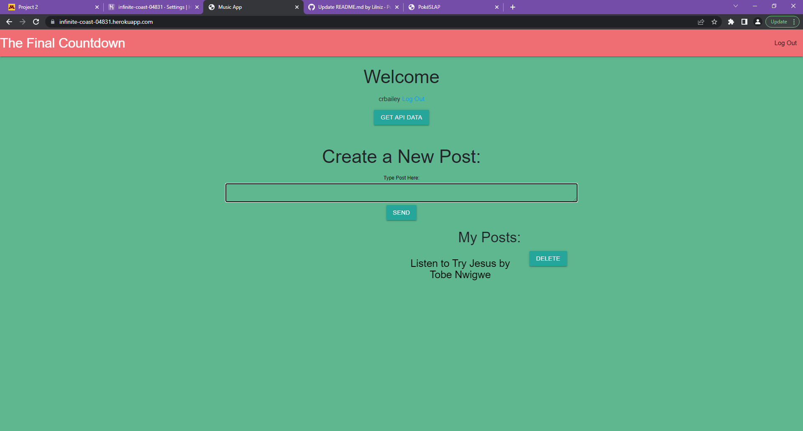

# Project-2-Wat-Da-Song-Gon-Be
    
    Creator:Craig Bailey, Lee Boettcher, Eden Yiglletu, Elijha Gordon

  ## Description
    The Final Countdown is a web application, that allows users to share their playlists, artists, songs, or other 
    favorite music, to their personalpage. Spotify account required! Ultimately an app which would act like a spotify 
    live-blogging website, users would be allowed to follow others and view the other user's favorite music/posts! 
    It would have realtime/dynamic functionality while saving your own data in cookie-form, so that you may come 
    back and see all of your posts & updated spotify account data!
    

    

  ## Usage
    Upon visiting the site for the 1st time you will be shown a login and register buttons, clicking either will 
    take you to the corresponding page and allow you to create and account or to sign in to an already existing 
    account. After completetion of the previous step, you will be shown a page to authorize your Spotify account 
    and agree to share the data with the site. Following that you will land on your homepage where you can see your 
    username and any posts that you have sent. Sending posts happens through a text area located in the middle of 
    the screen. It also allows for deleting the posts. Clicking the api button will show your username and up to 20
    of your playlists from your Spotify accout.
  

  

